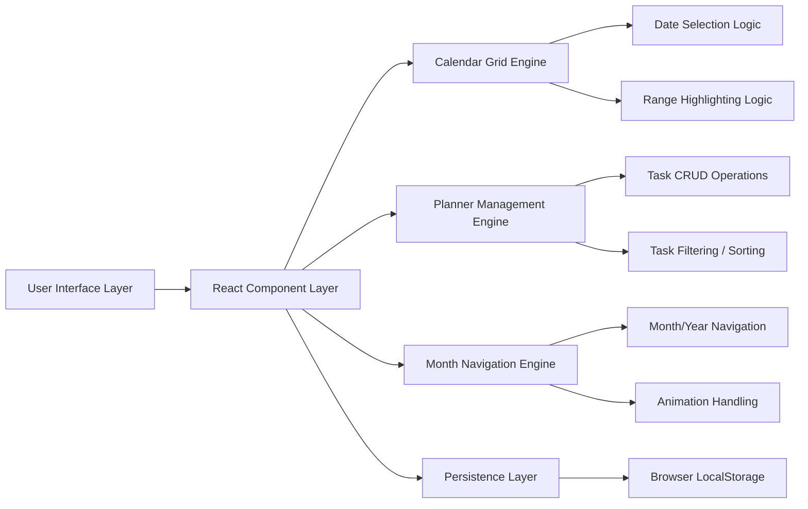
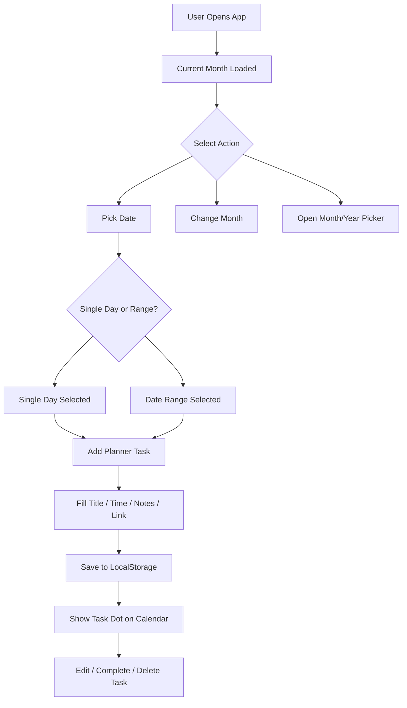
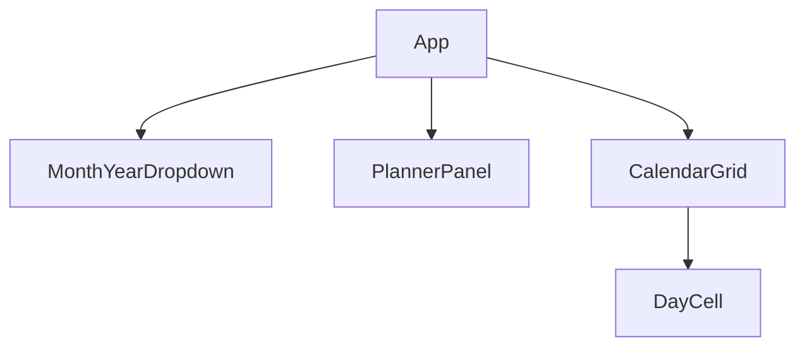

# Wall Calendar Planner – Student Productivity Calendar

An interactive **wall-calendar inspired productivity planner** built with **React + Vite**, designed to combine the aesthetics of a physical wall calendar with modern digital planning features.

Unlike traditional calendar replicas, this project extends the challenge into a **student-focused productivity tool** by integrating a structured task planner directly into the calendar workflow.

---

# 🚀 Live Concept

> **Problem Statement:**
> Build an interactive wall-calendar UI inspired by a physical hanging calendar with:

* Day range selection
* Integrated notes
* Responsive design

> **My Enhancement:**
> Instead of treating notes as plain text, I transformed the notes panel into a **smart student planner / task manager**.

Students often struggle with:

* Planning study schedules
* Tracking assignments across multiple days
* Managing resources/links for tasks
* Visualizing workload distribution

This project solves that by combining **calendar visualization + actionable planning**.

---

# ✨ Key Features

## Core Assignment Requirements

* Wall calendar aesthetic inspired by physical hanging calendars
* Dedicated hero image for each month
* Start and end date range selection
* Integrated notes/planner section
* Fully responsive desktop/mobile design

## Additional Product Enhancements

* Student-focused **Task Planner** instead of plain notes
* Add tasks for single day or date range
* Save:

  * Task Title
  * Time
  * Notes
  * Useful Links
* Mark tasks complete
* Delete/Edit tasks
* Holiday Indicators
* Task Indicators on Calendar Dates
* Month/Year Picker
* Today Shortcut
* Calendar Resize Controls
* Page Flip Month Animation
* Persistent Storage via LocalStorage

---

# 🧠 Product Thinking / Why This Is Unique

Most calendar apps stop at displaying dates.

This project extends the concept into a **lightweight academic planning assistant**:

### Example Use Cases

* Exam Preparation Planning
* Weekly Study Scheduling
* Assignment Tracking
* Sprint / Milestone Planning
* Daily Habit Planning
* Resource Link Management for Tasks

---

# 🏗 System Architecture



---

# 🔄 Application Flow



---

# 🧩 Component Architecture



---

# ⚙ Tech Stack

## Frontend

* React 19
* JavaScript (ES6+)
* CSS3

## Build Tools

* Vite
* ESLint

## Storage

* Browser LocalStorage

## Deployment

* GitHub Pages / Vercel / Netlify

---

# 🛠 Technical Implementation Details

## Calendar Engine

Dynamic calendar generation includes:

* Month length calculation
* Previous/next month overflow cells
* 6-row fixed calendar grid generation
* Leap year support

---

## Range Selection Logic

Supports:

* Single-day selection
* Multi-day range selection
* Hover preview during range selection
* Auto-swap if end date selected before start date

---

## Planner Engine

Planner supports full CRUD:

* Create Task
* Read Tasks for Selected Dates
* Update Existing Tasks
* Delete Tasks

Tasks are stored in normalized structure:

```js
{
  "2026-04-09": [
    {
      id: 1,
      title: "Study React",
      time: "18:00",
      notes: "Finish hooks chapter",
      link: "https://react.dev",
      done: false
    }
  ]
}
```

---

## Persistence Strategy

Uses `localStorage` for:

* Planner Data Persistence
* Calendar Size Preference Persistence

---

# 📱 Responsive Design Strategy

## Desktop Layout

* Side-by-side Calendar + Planner Panel

## Mobile Layout

* Stacked Vertical Layout
* Touch-Friendly Inputs
* Adaptive Planner Card Layout

---

# 📂 Folder Structure

```bash
src/
│
├── App.jsx
├── App.css
├── main.jsx
└── index.css
```

---

# ▶ Running Locally

```bash
npm install
npm run dev
```

---

# 🏗 Production Build

```bash
npm run build
```

---

# 🚀 Deployment

```bash
npm run deploy
```

---

# 🎥 Demo Highlights

The demo showcases:

* Interactive Date Range Selection
* Planner CRUD Operations
* Task Dots on Calendar
* Responsive Layout
* Page Flip Animations
* LocalStorage Persistence

---

# 📌 Future Improvements

Potential extensions:

* Drag & Drop Task Scheduling
* Recurring Tasks
* Google Calendar Sync
* Export Planner to PDF
* Dark Mode / Themes
* Collaborative Shared Calendars

---

# 👨‍💻 Author

**Soumya Ranjan Nayak**

Built as part of a Frontend Engineering Challenge to demonstrate:

* Product Thinking
* Frontend Architecture
* State Management
* UI/UX Design
* Responsive Engineering

---
